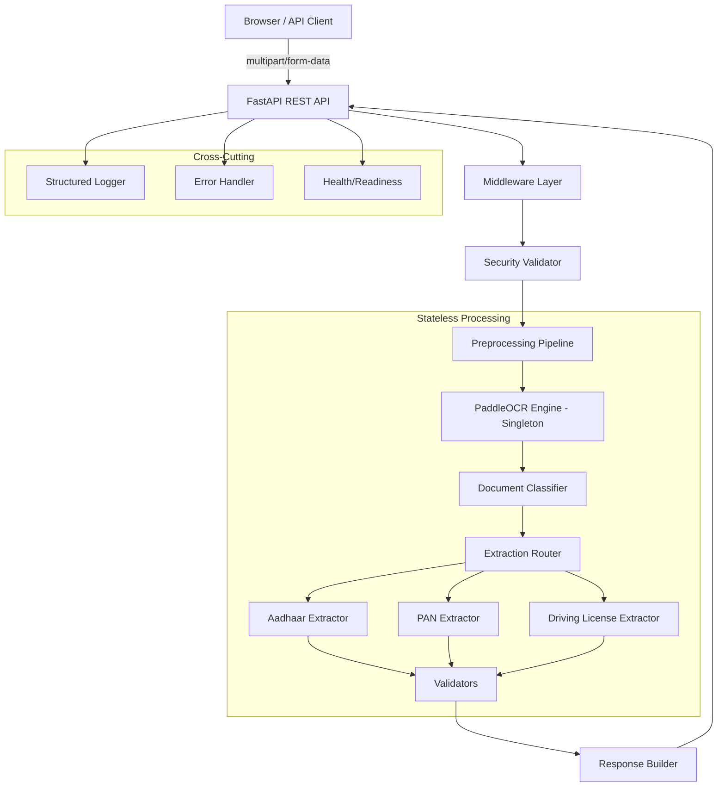
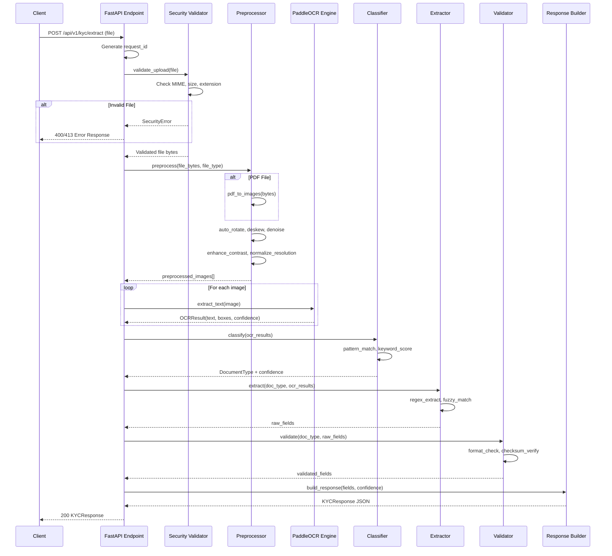
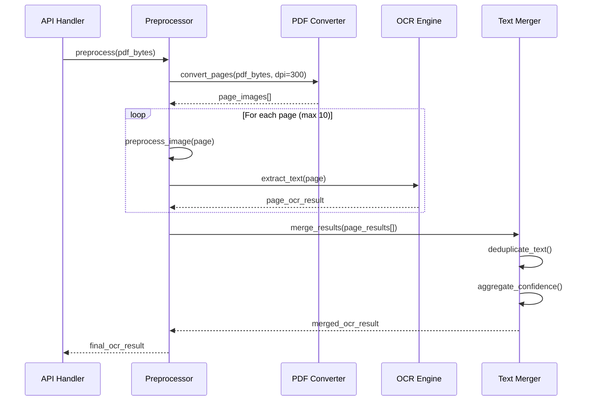

# Design Document: KYC Document Extraction System

## Overview

This system is a production-ready, stateless OCR-based KYC document extraction service for banking applications. It accepts images or PDFs of Indian identity documents (Aadhaar Card, PAN Card, Driving License), performs optical character recognition using PaddleOCR, classifies the document type, and extracts structured KYC fields with confidence scores.

The architecture is fully stateless — no database, no session storage, no file persistence. Documents are processed entirely in memory with automatic cleanup, enabling horizontal scaling behind a load balancer. The backend is built on FastAPI with async endpoints, a singleton OCR engine for performance, and structured JSON logging that never captures PII. The frontend is a minimal HTML/CSS/JS interface for file upload and result display.

The system targets sub-2-second processing for single images and sub-5-second processing for multi-page PDFs, with CPU-optimized inference and optional GPU acceleration.

## Architecture



## Sequence Diagrams

### Main KYC Extraction Flow



### PDF Multi-Page Processing



## Components and Interfaces

### Component 1: Security Validator

**Purpose**: Validates uploaded files for safety before any processing occurs.

```python
from dataclasses import dataclass
from enum import Enum

class AllowedMimeType(str, Enum):
    JPEG = "image/jpeg"
    PNG = "image/png"
    TIFF = "image/tiff"
    WEBP = "image/webp"
    PDF = "application/pdf"

@dataclass
class SecurityConfig:
    max_file_size_mb: int = 10
    max_pdf_pages: int = 10
    allowed_extensions: set[str] = frozenset({".jpg", ".jpeg", ".png", ".tiff", ".webp", ".pdf"})
    allowed_mime_types: set[str] = frozenset({m.value for m in AllowedMimeType})

class SecurityValidator:
    """Validates uploaded files for safety."""
    
    def validate_upload(self, file_bytes: bytes, filename: str, content_type: str) -> ValidatedFile:
        """Validate file type, size, magic bytes, and safety."""
        ...
    
    def _check_magic_bytes(self, file_bytes: bytes) -> str:
        """Detect actual file type from magic bytes."""
        ...
    
    def _check_pdf_safety(self, file_bytes: bytes) -> None:
        """Detect PDF bombs, excessive pages, malicious content."""
        ...
    
    def _sanitize_filename(self, filename: str) -> str:
        """Prevent path traversal and injection."""
        ...
```

**Responsibilities**:
- File size enforcement (max 10MB)
- MIME type validation against magic bytes
- Extension whitelist enforcement
- PDF bomb detection (page count, nested objects)
- Path traversal prevention
- Malicious content detection

### Component 2: Image Preprocessor

**Purpose**: Prepares raw images for optimal OCR accuracy.

```python
import numpy as np
from numpy.typing import NDArray

class ImagePreprocessor:
    """Pipeline for image enhancement before OCR."""
    
    def preprocess(self, image: NDArray[np.uint8]) -> NDArray[np.uint8]:
        """Run full preprocessing pipeline."""
        ...
    
    def auto_rotate(self, image: NDArray[np.uint8]) -> NDArray[np.uint8]:
        """Correct rotation using text orientation detection."""
        ...
    
    def deskew(self, image: NDArray[np.uint8]) -> NDArray[np.uint8]:
        """Correct skew angle using Hough transform."""
        ...
    
    def denoise(self, image: NDArray[np.uint8]) -> NDArray[np.uint8]:
        """Remove noise using bilateral filtering."""
        ...
    
    def enhance_contrast(self, image: NDArray[np.uint8]) -> NDArray[np.uint8]:
        """Apply CLAHE contrast enhancement."""
        ...
    
    def adaptive_threshold(self, image: NDArray[np.uint8]) -> NDArray[np.uint8]:
        """Apply adaptive thresholding for binarization."""
        ...
    
    def normalize_resolution(self, image: NDArray[np.uint8], target_dpi: int = 300) -> NDArray[np.uint8]:
        """Scale image to target DPI for consistent OCR."""
        ...
    
    def detect_blur(self, image: NDArray[np.uint8]) -> float:
        """Return blur score using Laplacian variance."""
        ...
```

**Responsibilities**:
- Auto-rotation correction
- Deskewing via Hough transform
- Noise reduction (bilateral filter)
- Contrast enhancement (CLAHE)
- Adaptive thresholding
- Resolution normalization to 300 DPI
- Blur detection and quality assessment

### Component 3: OCR Engine (Singleton)

**Purpose**: Thread-safe, singleton PaddleOCR engine for text extraction.

```python
import threading
from dataclasses import dataclass

@dataclass
class OCRResult:
    text: str
    boxes: list[list[list[int]]]
    confidences: list[float]
    avg_confidence: float

class OCREngine:
    """Singleton PaddleOCR wrapper with thread safety."""
    
    _instance: "OCREngine | None" = None
    _lock: threading.Lock = threading.Lock()
    
    def __new__(cls) -> "OCREngine":
        """Thread-safe singleton instantiation."""
        ...
    
    def _initialize(self) -> None:
        """Load PaddleOCR models once."""
        ...
    
    def extract_text(self, image: NDArray[np.uint8], languages: list[str] | None = None) -> OCRResult:
        """Extract text from preprocessed image."""
        ...
    
    def extract_batch(self, images: list[NDArray[np.uint8]]) -> list[OCRResult]:
        """Process multiple images efficiently."""
        ...
    
    @property
    def is_ready(self) -> bool:
        """Check if model is loaded and ready."""
        ...
```

**Responsibilities**:
- One-time model loading at startup
- Thread-safe inference via lock
- Multi-language support (English, Hindi, Marathi, Gujarati, Bengali, Tamil, Telugu, Kannada, Malayalam, Punjabi)
- Batch processing for multi-page documents
- Confidence score aggregation
- CPU-optimized with optional GPU detection

### Component 4: Document Classifier

**Purpose**: Determines document type from OCR text using pattern matching and confidence scoring.

```python
from enum import Enum

class DocumentType(str, Enum):
    AADHAAR_FRONT = "aadhaar_front"
    AADHAAR_BACK = "aadhaar_back"
    PAN_CARD = "pan_card"
    DRIVING_LICENSE = "driving_license"
    UNKNOWN = "unknown"

@dataclass
class ClassificationResult:
    document_type: DocumentType
    confidence: float
    matched_patterns: list[str]

class DocumentClassifier:
    """Classifies Indian KYC documents from OCR text."""
    
    def classify(self, ocr_result: OCRResult) -> ClassificationResult:
        """Determine document type from extracted text."""
        ...
    
    def _score_aadhaar_front(self, text: str) -> float:
        """Score likelihood of Aadhaar front."""
        ...
    
    def _score_aadhaar_back(self, text: str) -> float:
        """Score likelihood of Aadhaar back."""
        ...
    
    def _score_pan(self, text: str) -> float:
        """Score likelihood of PAN card."""
        ...
    
    def _score_driving_license(self, text: str) -> float:
        """Score likelihood of Driving License."""
        ...
```

**Responsibilities**:
- Keyword-based scoring (UIDAI, Income Tax, Transport)
- Regex pattern matching (Aadhaar format, PAN format, DL format)
- Confidence aggregation across multiple signals
- Handling ambiguous or poor-quality scans
- Distinguishing Aadhaar front from back

### Component 5: Extraction Engines

**Purpose**: Document-specific field extraction with regex, fuzzy matching, and validation.

```python
from abc import ABC, abstractmethod

@dataclass
class ExtractionField:
    value: str | None
    confidence: float
    raw_text: str | None = None

class BaseExtractor(ABC):
    """Abstract base for document-specific extractors."""
    
    @abstractmethod
    def extract(self, ocr_result: OCRResult) -> dict[str, ExtractionField]:
        """Extract structured fields from OCR result."""
        ...
    
    def _fuzzy_match(self, text: str, pattern: str, threshold: float = 0.8) -> str | None:
        """Fuzzy string matching for noisy OCR text."""
        ...
    
    def _normalize_name(self, name: str) -> str:
        """Normalize Indian names (handle initials, titles, transliteration)."""
        ...

class AadhaarExtractor(BaseExtractor):
    """Extracts fields from Aadhaar card (front and back)."""
    
    def extract(self, ocr_result: OCRResult) -> dict[str, ExtractionField]:
        """Extract: aadhaar_number, name, dob, gender, address, pincode, state."""
        ...
    
    def _extract_aadhaar_number(self, text: str) -> ExtractionField:
        """Extract 12-digit Aadhaar with masked format support."""
        ...
    
    def _validate_verhoeff(self, number: str) -> bool:
        """Validate Aadhaar using Verhoeff checksum algorithm."""
        ...

class PANExtractor(BaseExtractor):
    """Extracts fields from PAN card."""
    
    def extract(self, ocr_result: OCRResult) -> dict[str, ExtractionField]:
        """Extract: pan_number, name, father_name, dob."""
        ...
    
    def _extract_pan_number(self, text: str) -> ExtractionField:
        """Extract PAN in ABCDE1234F format."""
        ...

class DrivingLicenseExtractor(BaseExtractor):
    """Extracts fields from Indian Driving License."""
    
    def extract(self, ocr_result: OCRResult) -> dict[str, ExtractionField]:
        """Extract: license_number, name, dob, issue_date, expiry_date, address, issuing_authority."""
        ...
```

**Responsibilities**:
- Aadhaar: 12-digit number (masked/unmasked), Verhoeff validation, name, DOB, gender, full address with pincode and state
- PAN: ABCDE1234F format validation, name, father's name, DOB
- Driving License: Multiple state formats, dates, issuing authority
- Fuzzy matching for OCR errors
- Indian name normalization
- Address parsing with state detection
- Field-level confidence scoring

### Component 6: Validators

**Purpose**: Post-extraction validation of fields using checksums, formats, and rules.

```python
class FieldValidator:
    """Validates extracted KYC fields."""
    
    def validate_aadhaar_number(self, number: str) -> ValidationResult:
        """Validate Aadhaar: 12 digits + Verhoeff checksum."""
        ...
    
    def validate_pan_number(self, pan: str) -> ValidationResult:
        """Validate PAN: regex ABCDE1234F."""
        ...
    
    def validate_date(self, date_str: str) -> ValidationResult:
        """Validate and normalize date formats (DD/MM/YYYY, DD-MM-YYYY, etc.)."""
        ...
    
    def validate_pincode(self, pincode: str) -> ValidationResult:
        """Validate Indian PIN code (6 digits, valid range)."""
        ...
    
    def validate_license_number(self, license_no: str) -> ValidationResult:
        """Validate DL number format (state-code + number)."""
        ...

@dataclass
class ValidationResult:
    is_valid: bool
    normalized_value: str | None = None
    error_message: str | None = None
```

## Data Models

### Request/Response Schemas

```python
from pydantic import BaseModel, Field
from datetime import datetime

class KYCExtractionResponse(BaseModel):
    """Main API response model."""
    request_id: str = Field(description="Unique request identifier")
    document_type: DocumentType
    classification_confidence: float = Field(ge=0.0, le=1.0)
    extracted_data: AadhaarData | PANData | DrivingLicenseData
    processing_time_ms: int
    ocr_confidence: float = Field(ge=0.0, le=1.0)
    timestamp: datetime

class AadhaarData(BaseModel):
    """Extracted Aadhaar card fields."""
    aadhaar_number: str | None = Field(None, pattern=r"^[X\d]{4}\s?\d{4}\s?\d{4}$")
    name: str | None = None
    dob: str | None = None
    gender: str | None = Field(None, pattern=r"^(Male|Female|Other)$")
    address: str | None = None
    pincode: str | None = Field(None, pattern=r"^\d{6}$")
    state: str | None = None
    confidence_score: float = Field(ge=0.0, le=1.0)

class PANData(BaseModel):
    """Extracted PAN card fields."""
    pan_number: str | None = Field(None, pattern=r"^[A-Z]{5}\d{4}[A-Z]$")
    name: str | None = None
    father_name: str | None = None
    dob: str | None = None
    confidence_score: float = Field(ge=0.0, le=1.0)

class DrivingLicenseData(BaseModel):
    """Extracted Driving License fields."""
    license_number: str | None = None
    name: str | None = None
    dob: str | None = None
    issue_date: str | None = None
    expiry_date: str | None = None
    address: str | None = None
    issuing_authority: str | None = None
    confidence_score: float = Field(ge=0.0, le=1.0)

class ErrorResponse(BaseModel):
    """Structured error response."""
    request_id: str
    error_code: str
    error_message: str
    details: dict | None = None
    timestamp: datetime
```

**Validation Rules**:
- Aadhaar number: 12 digits or masked format (XXXX XXXX 1234), Verhoeff checksum
- PAN number: Regex `[A-Z]{5}[0-9]{4}[A-Z]`, 4th char encodes holder type
- Pincode: 6 digits, first digit 1-9
- Dates: Multiple formats normalized to DD/MM/YYYY
- Confidence scores: Float 0.0-1.0
- All string fields: Stripped, normalized whitespace

## Key Functions with Formal Specifications

### Function 1: validate_upload()

```python
def validate_upload(file_bytes: bytes, filename: str, content_type: str) -> ValidatedFile:
    """Validate uploaded file for safety and compatibility."""
    ...
```

**Preconditions:**
- `file_bytes` is non-empty (`len(file_bytes) > 0`)
- `filename` is a non-empty string
- `content_type` is a non-empty string

**Postconditions:**
- Returns `ValidatedFile` if all checks pass
- Raises `FileTooLargeError` if `len(file_bytes) > max_file_size`
- Raises `InvalidFileTypeError` if MIME type not in allowed set
- Raises `MaliciousFileError` if PDF bomb or malicious content detected
- Magic bytes match declared content_type
- No side effects on input bytes

### Function 2: preprocess()

```python
def preprocess(image: NDArray[np.uint8]) -> NDArray[np.uint8]:
    """Run full image preprocessing pipeline."""
    ...
```

**Preconditions:**
- `image` is a valid numpy array with dtype uint8
- `image.ndim` in {2, 3} (grayscale or BGR)
- `image.size > 0`

**Postconditions:**
- Returns preprocessed image as numpy array
- Output has consistent DPI (300)
- Output is deskewed (skew angle < 1 degree)
- Output noise level is reduced
- No modification to input array (new array returned)
- Output dimensions may differ from input (rotation, scaling)

**Loop Invariants:** N/A

### Function 3: extract_text()

```python
def extract_text(image: NDArray[np.uint8], languages: list[str] | None = None) -> OCRResult:
    """Extract text from preprocessed image using PaddleOCR."""
    ...
```

**Preconditions:**
- `image` is preprocessed (300 DPI, deskewed, enhanced)
- OCR engine is initialized (`self.is_ready == True`)
- `languages` if provided, contains valid language codes

**Postconditions:**
- Returns `OCRResult` with text, bounding boxes, and confidence scores
- `ocr_result.text` is non-empty string if any text detected
- `ocr_result.confidences` has same length as detected text boxes
- `0.0 <= ocr_result.avg_confidence <= 1.0`
- Thread-safe (lock acquired and released)

### Function 4: classify()

```python
def classify(ocr_result: OCRResult) -> ClassificationResult:
    """Classify document type from OCR text."""
    ...
```

**Preconditions:**
- `ocr_result` contains non-empty text
- `ocr_result.avg_confidence > 0.1` (minimum quality threshold)

**Postconditions:**
- Returns exactly one `ClassificationResult`
- `result.document_type` is a valid `DocumentType` enum value
- `0.0 <= result.confidence <= 1.0`
- If `result.confidence < 0.5`, `result.document_type == DocumentType.UNKNOWN`
- `result.matched_patterns` lists all patterns that contributed to classification

### Function 5: validate_verhoeff()

```python
def validate_verhoeff(number: str) -> bool:
    """Validate Aadhaar number using Verhoeff checksum algorithm."""
    ...
```

**Preconditions:**
- `number` contains only digits
- `len(number) == 12`

**Postconditions:**
- Returns `True` if and only if Verhoeff checksum is valid
- No side effects
- Deterministic (same input always produces same output)

**Loop Invariants:**
- At each iteration `i`, `checksum` reflects the accumulated Verhoeff computation for digits `0..i`

## Algorithmic Pseudocode

### Main Extraction Pipeline

```python
async def process_kyc_extraction(file: UploadFile) -> KYCExtractionResponse:
    """
    Main KYC extraction pipeline.
    
    ALGORITHM:
    1. Validate file safety
    2. Convert to processable images
    3. Preprocess each image
    4. Run OCR on each image
    5. Merge multi-page results
    6. Classify document type
    7. Extract fields based on type
    8. Validate extracted fields
    9. Build and return response
    """
    request_id = generate_request_id()
    start_time = time.monotonic()
    
    try:
        # Step 1: Security validation
        file_bytes = await file.read()
        validated = security_validator.validate_upload(file_bytes, file.filename, file.content_type)
        
        # Step 2: Convert to images
        if validated.is_pdf:
            images = pdf_converter.to_images(file_bytes, max_pages=10, dpi=300)
        else:
            images = [decode_image(file_bytes)]
        
        # Step 3 & 4: Preprocess and OCR each image
        ocr_results: list[OCRResult] = []
        for image in images:
            preprocessed = preprocessor.preprocess(image)
            ocr_result = ocr_engine.extract_text(preprocessed)
            ocr_results.append(ocr_result)
        
        # Step 5: Merge multi-page results
        merged = text_merger.merge(ocr_results) if len(ocr_results) > 1 else ocr_results[0]
        
        # Step 6: Classify document
        classification = classifier.classify(merged)
        
        # Step 7: Extract fields
        extractor = extraction_router.get_extractor(classification.document_type)
        raw_fields = extractor.extract(merged)
        
        # Step 8: Validate fields
        validated_fields = field_validator.validate_all(classification.document_type, raw_fields)
        
        # Step 9: Build response
        processing_time = int((time.monotonic() - start_time) * 1000)
        return build_response(request_id, classification, validated_fields, processing_time, merged.avg_confidence)
    
    finally:
        # Stateless cleanup - no PII retention
        del file_bytes
        clear_temp_data()
```

### Verhoeff Checksum Algorithm

```python
def validate_verhoeff(number: str) -> bool:
    """
    Verhoeff checksum validation for Aadhaar numbers.
    
    Uses three tables: multiplication (d), permutation (p), inverse (inv).
    The checksum is valid if the final accumulated value is 0.
    """
    # Verhoeff multiplication table
    d = [
        [0,1,2,3,4,5,6,7,8,9], [1,2,3,4,0,6,7,8,9,5],
        [2,3,4,0,1,7,8,9,5,6], [3,4,0,1,2,8,9,5,6,7],
        [4,0,1,2,3,9,5,6,7,8], [5,9,8,7,6,0,4,3,2,1],
        [6,5,9,8,7,1,0,4,3,2], [7,6,5,9,8,2,1,0,4,3],
        [8,7,6,5,9,3,2,1,0,4], [9,8,7,6,5,4,3,2,1,0],
    ]
    
    # Verhoeff permutation table
    p = [
        [0,1,2,3,4,5,6,7,8,9], [1,5,7,6,2,8,3,0,9,4],
        [5,8,0,3,7,9,6,1,4,2], [8,9,1,6,0,4,3,5,2,7],
        [9,4,5,3,1,2,6,8,7,0], [4,2,8,6,5,7,3,9,0,1],
        [2,7,9,3,8,0,6,4,1,5], [7,0,4,6,9,1,3,2,5,8],
    ]
    
    checksum = 0
    reversed_digits = [int(x) for x in reversed(number)]
    
    for i, digit in enumerate(reversed_digits):
        # INVARIANT: checksum == accumulated Verhoeff value for digits[0..i-1]
        checksum = d[checksum][p[i % 8][digit]]
    
    return checksum == 0
```

### Document Classification Algorithm

```python
def classify(ocr_result: OCRResult) -> ClassificationResult:
    """
    Multi-signal document classification.
    
    ALGORITHM:
    1. Normalize OCR text (lowercase, remove extra whitespace)
    2. Score each document type using keyword + regex signals
    3. Select highest scoring type above threshold
    4. Return UNKNOWN if below confidence threshold
    """
    text = normalize_text(ocr_result.text)
    scores: dict[DocumentType, float] = {}
    patterns_matched: dict[DocumentType, list[str]] = {}
    
    # Aadhaar Front signals
    aadhaar_front_signals = [
        (r"\d{4}\s?\d{4}\s?\d{4}", 0.3, "aadhaar_number_pattern"),
        (r"(uidai|unique identification)", 0.2, "uidai_keyword"),
        (r"(government of india|भारत सरकार)", 0.15, "govt_india"),
        (r"(male|female|पुरुष|महिला)", 0.1, "gender_keyword"),
        (r"(date of birth|dob|जन्म तिथि)", 0.1, "dob_keyword"),
    ]
    
    # Aadhaar Back signals
    aadhaar_back_signals = [
        (r"\d{4}\s?\d{4}\s?\d{4}", 0.25, "aadhaar_number_pattern"),
        (r"(address|पता)", 0.25, "address_keyword"),
        (r"(pin\s*code|pincode|\d{6})", 0.15, "pincode_pattern"),
        (r"(uidai|unique identification)", 0.15, "uidai_keyword"),
    ]
    
    # PAN signals
    pan_signals = [
        (r"[A-Z]{5}\d{4}[A-Z]", 0.35, "pan_number_pattern"),
        (r"(income tax|permanent account)", 0.25, "income_tax_keyword"),
        (r"(father|पिता)", 0.15, "father_name_keyword"),
        (r"(govt\.?\s*of\s*india|भारत सरकार)", 0.1, "govt_india"),
    ]
    
    # Driving License signals
    dl_signals = [
        (r"(driving|licence|license)", 0.25, "dl_keyword"),
        (r"(transport|rto|regional transport)", 0.2, "transport_keyword"),
        (r"(validity|expiry|issue date)", 0.15, "date_keywords"),
        (r"(motor vehicle|non-transport|transport)", 0.15, "vehicle_class"),
        (r"[A-Z]{2}\d{2}\s?\d{11}", 0.15, "dl_number_pattern"),
    ]
    
    for doc_type, signals in [
        (DocumentType.AADHAAR_FRONT, aadhaar_front_signals),
        (DocumentType.AADHAAR_BACK, aadhaar_back_signals),
        (DocumentType.PAN_CARD, pan_signals),
        (DocumentType.DRIVING_LICENSE, dl_signals),
    ]:
        score = 0.0
        matched = []
        for pattern, weight, name in signals:
            if re.search(pattern, text, re.IGNORECASE):
                score += weight
                matched.append(name)
        scores[doc_type] = min(score, 1.0)
        patterns_matched[doc_type] = matched
    
    # Select best match
    best_type = max(scores, key=scores.get)
    best_score = scores[best_type]
    
    if best_score < 0.5:
        return ClassificationResult(
            document_type=DocumentType.UNKNOWN,
            confidence=best_score,
            matched_patterns=patterns_matched.get(best_type, []),
        )
    
    return ClassificationResult(
        document_type=best_type,
        confidence=best_score,
        matched_patterns=patterns_matched[best_type],
    )
```

### Image Preprocessing Pipeline

```python
def preprocess(image: NDArray[np.uint8]) -> NDArray[np.uint8]:
    """
    Full preprocessing pipeline.
    
    ALGORITHM:
    1. Convert to grayscale if color
    2. Normalize resolution to 300 DPI
    3. Detect and correct rotation
    4. Deskew using Hough transform
    5. Denoise using bilateral filter
    6. Enhance contrast using CLAHE
    7. Apply adaptive thresholding if needed
    
    Each step is applied only if quality metrics indicate improvement.
    """
    # Step 1: Grayscale conversion
    if image.ndim == 3:
        gray = cv2.cvtColor(image, cv2.COLOR_BGR2GRAY)
    else:
        gray = image.copy()
    
    # Step 2: Resolution normalization
    gray = normalize_resolution(gray, target_dpi=300)
    
    # Step 3: Auto-rotation (0, 90, 180, 270 degree correction)
    gray = auto_rotate(gray)
    
    # Step 4: Deskew
    angle = detect_skew_angle(gray)
    if abs(angle) > 0.5:  # Only correct if skew > 0.5 degrees
        gray = rotate_image(gray, -angle)
    
    # Step 5: Denoise
    blur_score = detect_blur(gray)
    if blur_score < 100:  # Low Laplacian variance = blurry
        gray = cv2.bilateralFilter(gray, d=9, sigmaColor=75, sigmaSpace=75)
    
    # Step 6: Contrast enhancement
    clahe = cv2.createCLAHE(clipLimit=2.0, tileGridSize=(8, 8))
    gray = clahe.apply(gray)
    
    # Step 7: Adaptive threshold (only for very low contrast)
    if np.std(gray) < 40:  # Low standard deviation = low contrast
        gray = cv2.adaptiveThreshold(
            gray, 255, cv2.ADAPTIVE_THRESH_GAUSSIAN_C, cv2.THRESH_BINARY, 11, 2
        )
    
    return gray
```

## Example Usage

```python
# Example 1: Basic API usage with httpx
import httpx

async def extract_kyc(file_path: str) -> dict:
    async with httpx.AsyncClient() as client:
        with open(file_path, "rb") as f:
            response = await client.post(
                "http://localhost:8000/api/v1/kyc/extract",
                files={"file": (file_path, f, "image/jpeg")},
            )
        return response.json()

# Example 2: Response structure
result = {
    "request_id": "req_abc123def456",
    "document_type": "aadhaar_front",
    "classification_confidence": 0.92,
    "extracted_data": {
        "aadhaar_number": "XXXX XXXX 4567",
        "name": "RAJESH KUMAR",
        "dob": "15/08/1990",
        "gender": "Male",
        "address": None,
        "pincode": None,
        "state": None,
        "confidence_score": 0.87,
    },
    "processing_time_ms": 1450,
    "ocr_confidence": 0.89,
    "timestamp": "2024-01-15T10:30:00Z",
}

# Example 3: Error response
error_result = {
    "request_id": "req_xyz789",
    "error_code": "INVALID_FILE_TYPE",
    "error_message": "File type 'application/x-executable' is not allowed",
    "details": {"allowed_types": ["image/jpeg", "image/png", "image/tiff", "image/webp", "application/pdf"]},
    "timestamp": "2024-01-15T10:31:00Z",
}

# Example 4: Health check
# GET /health -> {"status": "healthy", "ocr_engine": "ready", "uptime_seconds": 3600}
# GET /ready -> {"ready": true, "checks": {"ocr_model": true, "memory_ok": true}}
```

## Correctness Properties

*A property is a characteristic or behavior that should hold true across all valid executions of a system — essentially, a formal statement about what the system should do. Properties serve as the bridge between human-readable specifications and machine-verifiable correctness guarantees.*

### Property 1: File size enforcement

*For any* file where the byte length exceeds 10MB, the Security Validator SHALL reject it with a FileTooLargeError, and for any file within the size limit with a valid type, it SHALL be accepted.

**Validates: Requirements 1.1**

### Property 2: Magic bytes override declared content type

*For any* file upload where the magic bytes indicate a different file type than the declared content type, the Security Validator SHALL use the magic bytes determination as the true file type for acceptance or rejection.

**Validates: Requirements 1.2**

### Property 3: File extension and MIME type enforcement

*For any* file whose extension is not in the allowed set (.jpg, .jpeg, .png, .tiff, .webp, .pdf) or whose true MIME type is disallowed, the Security Validator SHALL reject the file with INVALID_FILE_TYPE.

**Validates: Requirements 1.3, 1.6**

### Property 4: Filename sanitization removes traversal characters

*For any* filename string containing path traversal characters (../, ..\, /, \, or null bytes), the sanitized output SHALL not contain any of these characters.

**Validates: Requirements 1.5**

### Property 5: Preprocessing immutability

*For any* input image array, after calling the preprocessing pipeline, the original input array SHALL remain unchanged (byte-for-byte identical to its state before the call).

**Validates: Requirements 2.6**

### Property 6: Grayscale conversion

*For any* 3-channel color image (ndim == 3), the preprocessing output SHALL be a single-channel grayscale image (ndim == 2).

**Validates: Requirements 2.3**

### Property 7: Preprocessing idempotence

*For any* image, applying the preprocessing pipeline twice SHALL produce OCR results equivalent to applying it once (the second preprocessing does not degrade quality).

**Validates: Requirements 2.1, 2.2, 2.5**

### Property 8: OCR engine singleton identity

*For any* number of calls to the OCREngine constructor, all calls SHALL return the exact same object instance.

**Validates: Requirements 3.1**

### Property 9: OCR confidence aggregation consistency

*For any* OCRResult, the avg_confidence field SHALL equal the arithmetic mean of the individual confidence scores in the confidences list.

**Validates: Requirements 3.2**

### Property 10: Batch OCR result count

*For any* list of N input images provided to batch processing, the OCR engine SHALL return exactly N OCRResult objects.

**Validates: Requirements 3.4**

### Property 11: Classification confidence bounds and threshold

*For any* OCR text input, the Classifier SHALL return a confidence score in the range [0.0, 1.0], and if that score is below 0.5, the document_type SHALL be UNKNOWN.

**Validates: Requirements 4.2, 4.3**

### Property 12: Verhoeff checksum correctness

*For any* 12-digit numeric string, the Verhoeff validation function SHALL return True if and only if the Verhoeff checksum of that number is valid (deterministic, no false positives or negatives).

**Validates: Requirements 5.4**

### Property 13: PAN format validation

*For any* string, the PAN validator SHALL accept it if and only if it matches the regex pattern ^[A-Z]{5}[0-9]{4}[A-Z]$.

**Validates: Requirements 6.2**

### Property 14: Extraction confidence scores bounds

*For any* extraction result from any document type (Aadhaar, PAN, or Driving License), every per-field confidence score SHALL be in the range [0.0, 1.0].

**Validates: Requirements 5.5, 6.3, 7.3**

### Property 15: Date normalization round-trip

*For any* valid date string in a recognized input format (DD-MM-YYYY, DD/MM/YYYY, DD.MM.YYYY, YYYY-MM-DD), the Field Validator SHALL normalize it to DD/MM/YYYY format, and the normalized output SHALL represent the same calendar date as the input.

**Validates: Requirements 8.1**

### Property 16: Pincode validation

*For any* string, the pincode validator SHALL accept it if and only if it is exactly 6 digits with the first digit between 1 and 9.

**Validates: Requirements 8.2**

### Property 17: API response structural completeness

*For any* successful extraction, the API response SHALL contain all required fields: request_id, document_type, classification_confidence, extracted_data, processing_time_ms, ocr_confidence, and timestamp.

**Validates: Requirements 9.2**

### Property 18: Request ID uniqueness

*For any* two API requests, the generated request_id values SHALL be distinct.

**Validates: Requirements 9.6**

### Property 19: PDF page limit enforcement

*For any* PDF document with more than 10 pages, the System SHALL process at most 10 pages.

**Validates: Requirements 10.2**

### Property 20: No PII in logs

*For any* log entry produced during request processing, the entry SHALL not contain patterns matching Aadhaar numbers, PAN numbers, or raw personal names from the document.

**Validates: Requirements 12.2, 12.3**

### Property 21: Low OCR confidence produces UNKNOWN response

*For any* OCR result with average confidence below 0.3, the System SHALL return a response with document_type set to UNKNOWN and empty extraction fields.

**Validates: Requirements 13.3**

## Error Handling

### Error Scenario 1: Invalid File Upload

**Condition**: File exceeds size limit, has invalid MIME type, or contains malicious content
**Response**: HTTP 400/413 with structured `ErrorResponse` containing specific error code (`INVALID_FILE_TYPE`, `FILE_TOO_LARGE`, `MALICIOUS_CONTENT`)
**Recovery**: Client retries with valid file. No server state affected.

### Error Scenario 2: OCR Engine Not Ready

**Condition**: Model still loading at startup or failed to initialize
**Response**: HTTP 503 Service Unavailable with `OCR_NOT_READY` error code
**Recovery**: Readiness probe (`GET /ready`) returns false; orchestrator/load balancer routes traffic to healthy instances.

### Error Scenario 3: Low Quality / Unreadable Document

**Condition**: OCR confidence below threshold (< 0.3), no text extracted
**Response**: HTTP 200 with `document_type: "unknown"` and empty extraction fields. Includes `ocr_confidence` score for client to decide.
**Recovery**: Client may retry with higher quality scan.

### Error Scenario 4: Processing Timeout

**Condition**: Complex multi-page PDF exceeds processing time budget
**Response**: HTTP 504 Gateway Timeout or HTTP 200 with partial results (configurable)
**Recovery**: Client splits document or retries individual pages.

### Error Scenario 5: Memory Pressure

**Condition**: Large file causes memory spike during image processing
**Response**: Graceful degradation with reduced DPI processing. If OOM unavoidable, return HTTP 507.
**Recovery**: Kubernetes restarts pod. Stateless design means no data loss.

### Error Scenario 6: Unexpected Exception

**Condition**: Unhandled exception in any processing stage
**Response**: Global exception handler catches, logs stack trace (without PII), returns HTTP 500 with generic error message and `request_id` for debugging.
**Recovery**: Request fails cleanly. No lingering temp files (finally block ensures cleanup).

## Testing Strategy

### Unit Testing Approach

- Test each extractor (Aadhaar, PAN, DL) with known OCR text samples
- Test Verhoeff algorithm with valid and invalid Aadhaar numbers
- Test PAN regex validation with edge cases
- Test document classifier with text samples from each document type
- Test security validator with various file types, sizes, and malicious payloads
- Test preprocessor steps individually (rotate, deskew, denoise)
- Mock OCR engine for deterministic testing
- Target: 90%+ code coverage

### Property-Based Testing Approach

**Property Test Library**: hypothesis (Python)

- Generate random 12-digit strings → verify Verhoeff accepts only valid checksums
- Generate random PAN-like strings → verify regex accepts only valid format
- Generate random file sizes → verify size limit enforcement is consistent
- Generate random confidence scores → verify classification threshold behavior
- Generate random image dimensions → verify preprocessing handles all sizes
- Generate random text with injected patterns → verify classifier scores correctly

### Integration Testing Approach

- End-to-end API tests with real document images (anonymized/synthetic)
- Test PDF multi-page processing pipeline
- Test concurrent request handling (thread safety of OCR singleton)
- Test health and readiness endpoints under load
- Docker container startup and model loading tests
- Memory leak detection with repeated processing

## Performance Considerations

- **OCR Model Loading**: Singleton pattern loads model once (~2-5s startup). Readiness probe prevents traffic before model is ready.
- **Target Latency**: <2s for single images, <5s for multi-page PDFs (at 300 DPI)
- **Memory**: Peak ~500MB per request for large PDFs. Immediate cleanup after processing.
- **CPU Optimization**: PaddleOCR with `use_gpu=False`, `enable_mkldnn=True` for CPU inference.
- **GPU Support**: Auto-detected via `paddle.device.is_compiled_with_cuda()`. 3-5x speedup when available.
- **Concurrency**: FastAPI async handlers + thread pool for CPU-bound OCR. Configurable worker count.
- **Image Resolution**: Normalize to 300 DPI — higher provides diminishing returns for document OCR.
- **Batch Processing**: Multi-page PDFs processed sequentially per page to control memory. Can be parallelized with worker pool for GPU instances.

## Security Considerations

- **Input Validation**: Multi-layer (extension → MIME → magic bytes → content inspection)
- **File Size Limits**: 10MB max upload, 10 pages max for PDFs
- **Temp File Security**: In-memory processing preferred. If temp files needed: random names, restricted permissions, guaranteed cleanup in `finally` block
- **Path Traversal**: Filename sanitization strips `..`, `/`, `\`, null bytes
- **PDF Bombs**: Page count check, decompression ratio limits, nested object depth limits
- **PII Protection**: Never logged, never persisted, cleared from memory after response
- **Rate Limiting**: Recommended at reverse proxy/API gateway level (not in-app for stateless design)
- **CORS**: Restricted to known origins in production
- **Content-Type Validation**: Server-side validation ignores client-declared content type in favor of magic byte detection

## Dependencies

| Dependency | Version | Purpose |
|-----------|---------|---------|
| Python | 3.12+ | Runtime |
| FastAPI | latest | Web framework |
| Uvicorn | latest | ASGI server |
| Gunicorn | latest | Process manager (production) |
| PaddleOCR | latest stable | OCR engine |
| PaddlePaddle | latest stable | ML framework (PaddleOCR dependency) |
| OpenCV (cv2) | latest | Image preprocessing |
| Pillow | latest | Image format handling |
| pdf2image | latest | PDF to image conversion |
| poppler-utils | system | PDF rendering (pdf2image dependency) |
| Pydantic | v2 | Data validation and schemas |
| python-multipart | latest | File upload handling |
| numpy | latest | Array operations |
| structlog | latest | Structured JSON logging |
| pytest | latest | Testing framework |
| pytest-asyncio | latest | Async test support |
| httpx | latest | Async HTTP client (testing) |
| hypothesis | latest | Property-based testing |
| Docker | latest | Containerization |
